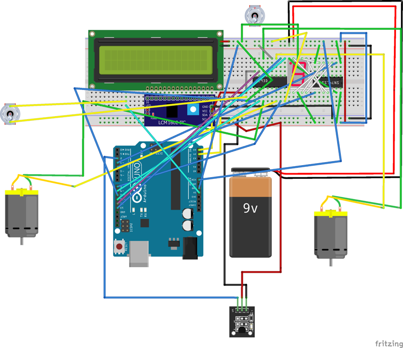
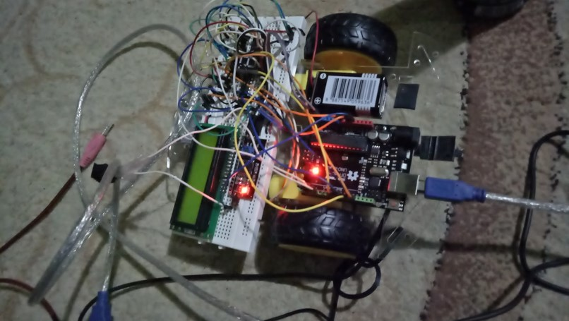

##Arduino Project

Untuk tugas besar IF3111 Platform-based Development kali ini, kami dari grup MieAceh mempersembahkan Arduino project dalam lanjutan aplikasi DamkarLearning.

Disini, kami membuat miniatur "pemadam kebakaran" dengan Arduino dan motor DC. Komponen-komponen nya yaitu:

- Arduino UNO
- LCD 16x2, untuk menampilkan suhu
- Sensor suhu Ky-001
- 7-Segment
- Sepasang Motor DC
- Serial Connection, untuk mengambil arah gerak dari *Cloud Service*

####Apa yang bisa dilakukan Arduino kami? 

Dengan komponen-komponen yang ada, kami bisa mengendalikannya dengan aplikasi Android **DamkarLearning**. Jadi, untuk arah geraknya dikendalikan melalui Android. Lalu, jika ada suhu yang terbaca tinggi, dia akan berusaha memadamkannya dalam hitungan 5..4..3..2..1.. PADAM!

Who We Are
-------------

> **Faza Thirafi** 13514033

> **Cut Meurah Rudi** 13514033

> **Muhammad Naufal** 13514073
